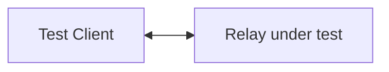
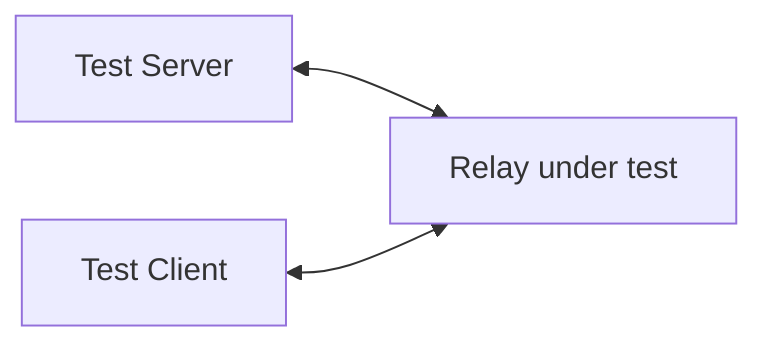
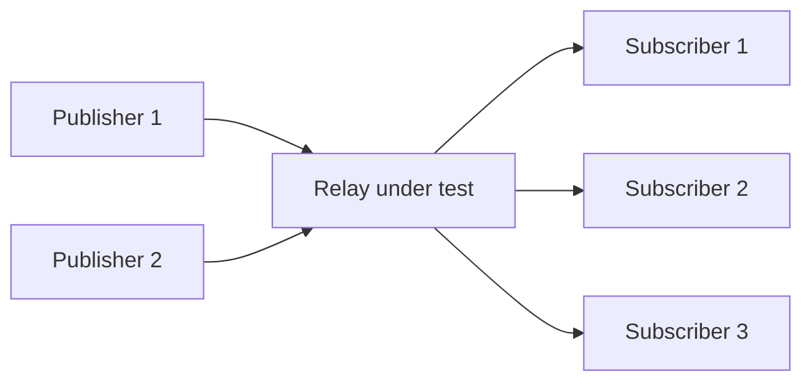
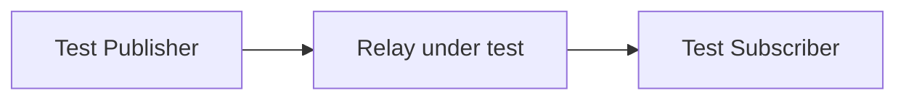
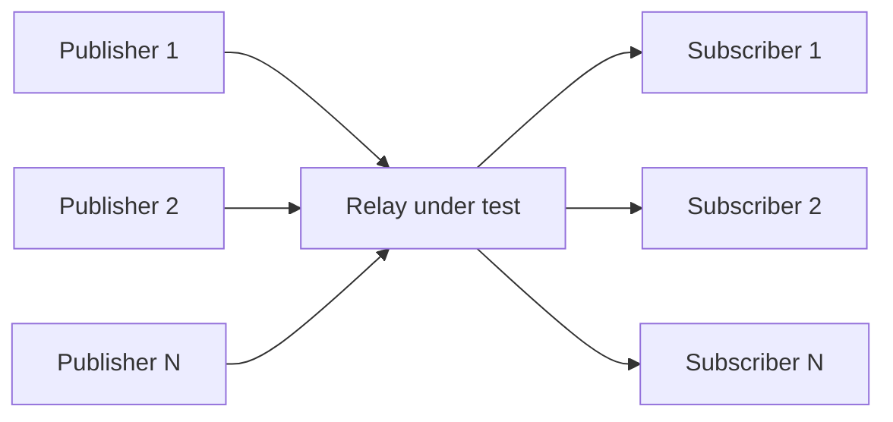
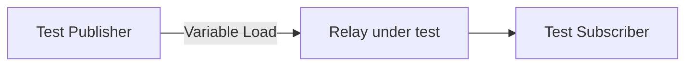
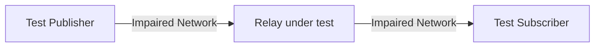

# MoQ Relay Test Requirements

*Version 00 \- Draft, February 2026*

**Status:** This is an initial draft for discussion and collaboration. Feedback is welcome on all aspects, particularly:
- Test coverage completeness
- MVP scope and compliance levels
- Implementation approach and tooling choices
- Missing test scenarios

# 1. Scope

This document defines the requirements for MoQ Relay Test, as part of the OpenMoQ project.  
The MoQ Relay Test is an set of tools to implement conformance and performance testing for verification of OpenMoQ Relay and other MoQT relay implementations.

# 2. Architecture

The output of this project shall be tool(s) capable of being used for an online compliance checker,integrated into CI framework for automated regression testing of MoQ Relay and other implementations.

## 2.1 MoQ library selection

Once the OpenMoQ relay is available it will used as the reference MoQT implementation.  
Consideration is made for building a pluggable framework where other MoQ implementations could be used to run the test suite.  
The test tool implements both a publisher and subscriber component in order to be able to test end to end functionality of a relay.  

## 2.2 Inputs
Accepts input URL of MoQ relay to run tests against.  
Accepts a list of tests to run against the relay, the tests should be described by a JSON or YAML style document.  

## 2.3 Outputs

Configurable output, possible output versions:

- JSON formatted object with success criteria suitable for use by other tools, CI pipeline, conformance test page, etc.  
- CSV formatted output for consumption by other tools.  
- Human readable cli output

### 2.3.1 Use cases

The build pipeline (using GitHub Actions, or similar) for the OpenMoQ relay should include a scripted process to take a successfully built container, deploy it to an instance and then attach the test harness and run the complete suite of tests. The output of the test suite should be recorded for tracking and later analysis.

## 2.4 Test framework

Implementation language to be discussed to ensure developer accessibility and ease of use.  
It would be preferred to use an existing test framework to build the tests in, it should be easily extensible, and should provide all MVP requirements. 

Common options considered include:
- C++ \+ Google Test: If performance testing requires minimal overhead  
- Python \+ pytest: Best for rapid development, extensive libraries, easy CI integration  
- Rust \+ cargo test: Modern alternative with safety guarantees  
- Consider a hybrid: Python for orchestration/reporting, C++/Rust for performance-critical components.

## 2.5 Test Environment Requirements

Test client should be deployable as a container which exposes required APIs.   
For conformance testing the network topology is not critical can be remote.  
For performance testing some of the testing will require the test client to be on a machine close the relay under test. This could include the localhost, same host, same rack or same datacenter.  
A basic conformance test client should be able to run a small VM instance (2 vCPU / 4G RAM).  
Performance test clients might need higher specification machines depending on the scope of test being run.  
Firewall will need to allow inbound QUIC port for subscription tests, port number should be configurable.  
Firewall will also need to allow control API / remote access.   
Certificates will be needed to setup TLS/QUIC connections and to verify authentication scenarios.

## 2.6 Test Data Specifications

Define standard test payloads (small: 100B, medium: 10KB, large: 1MB).  
Video/audio simulation patterns.  
Metadata formats for testing.  

## 2.7 Test Execution

Test ordering and dependencies (e.g., can't run 306 if 301 fails).  
Parallel vs. sequential execution strategy.  
Test isolation requirements.  
Retry policies for flaky tests.  

## 2.8 Reporting Requirements

Detailed failure diagnosis information.  
Performance metrics format (percentiles, histograms).  
Test duration tracking.  
Resource usage reporting during tests.  
Optional real time tracking of test progress.  

## 2.9 Test Dependencies
Prerequisites matrix.   
Optional vs required tests.  
Failure cascade handling.  

# 3. Test cases

The test cases are separated into two logical sets:

1. Conformance testing
   - C1 - Version testing  
   - C2 - Authentication  
   - C3 - Basic protocol exchanges  
   - C4 - Data formatting
   - C5 - Error Handling & Resilience
   - C6 - Multi-Client Scenarios
2. Performance testing
   - P1 - Throughput & Latency  
   - P2 - Scalability
   - P3 - Stress Testing
   - P4 - Network Conditions

## 3.1 Conformance testing

All tests can be run as Raw QUIC or WebTransport, the protocol should be selectable at start of test run.

### 3.1.1 Version testing

The test tool should be able to probe the relay and report all versions that relay will support.

| ID | Description | Type | Notes |
| :---- | :---- | :---- | :---- |
| C-101 | Supported version check | connect | Test tool probes to see which versions are supported |

### 3.1.2 Authentication testing

The test tool should be able to validate that the relay is correctly configured and secured

| ID | Description | Type | Notes |
| :---- | :---- | :---- | :---- |
| C-201 | Anonymous connection | auth | Verify relay allows unauthenticated connections if supported |
| C-202 | Valid token/credential authentication | auth | Verify successful connection with valid authentication credentials |
| C-203 | Invalid token rejection | auth | Verify relay rejects connections with invalid credentials |
| C-204 | Expired token handling | auth | Verify relay rejects connections with expired tokens |
| C-205 | Authorization for namespace publishing | auth | Verify authenticated client can publish to authorized namespace only |
| C-206 | Authorization for namespace subscription | auth | Verify authenticated client can subscribe to authorized namespace only |
| C-207 | Cross-namespace access control | auth | Verify client cannot access namespaces outside their authorization scope |
| C-208 | Token refresh/renewal flow | auth | Verify token refresh mechanism works without connection interruption |

### 3.1.3 Basic protocol exchanges

This set of tests comprises verification of correct message exchange, does the relay respond with correctly formatted handshake messages.

| ID | Description | Type | Notes |
| :---- | :---- | :---- | :---- |
| C-301 | PublishTest | basic | Verifies that a client can successfully publish a track to the relay |
| C-302 | PublishNamespaceTest | basic | Verifies that a publisher can announce a namespace to the relay |
| C-303 | PublishNamespaceDoneTest | basic | Verifies that a publisher can signal publish done for a namespace to the relay |
| C-304 | GoawayTest | basic | Verifies that a client can successfully send a goaway signal after publishing a track to the relay |
| C-305 | MaxRequestIdTest | basic | Verifies that a client can successfully set the maximum concurrent requests on a MoQ session |
| C-306 | SubscribeTest | basic | Verifies that a client can subscribe to a published track via the relay |
| C-307 | SubscribeErrorTest | basic | Verifies that a client receives an error when subscribing to a non-existent track |
| C-308 | SubscribeNamespaceTest | basic | Verifies that a client can subscribe to a namespace via the relay |
| C-309 | SubscribeNamespaceErrorTest | basic | Verifies that subscribing to a non-announced namespace fails appropriately |
| C-310 | TrackStatusTest | basic | Verifies that a client can request track status for a published track via the relay |

### 3.1.4 Data formatting 

Lower level tests that look at the construction of the data on wire and whether all the modes are as described.  
As a starting point the following [https://afrind.github.io/moq-test/draft-afrind-moq-test.html](https://afrind.github.io/moq-test/draft-afrind-moq-test.html) is as template for starting point for different scenarios to verify

A test server publishes a moq-test-00 namespace to relay, then responds to specific namespace constructions per draft-afind-moq-test

The publisher tool should execute all the scenarios below and verify the wire format is as described. Using tests from [Moxygen (conformance\_test.sh)](https://github.com/facebookexperimental/moxygen/blob/main/moxygen/moqtest/conformance_test.sh) as starting point.  
We should consider UUID-namespaced test paths like test-{uuid}/moq-test-00 to avoid namespace collisons. We should also add tests to verify if a namespace is already in use prior testing.

| ID | Description | Type | Notes |
| :---- | :---- | :---- | :---- |
| C-400 | Start server and announce namespace | publish | If fails do not run 3xx tests Check for existing moq-test-00 namespace? |

#### 3.1.4.1 Basic Forwarding Preferences

Tests covering the four fundamental MoQ forwarding preferences and FETCH operations.

| ID | Description | Type | Notes |
| :---- | :---- | :---- | :---- |
| C-401 | Basic subscribe with default parameters | subscribe | Tests ONE\_SUBGROUP\_PER\_GROUP forwarding with 2 groups, 5 objects each |
| C-402 | ONE\_SUBGROUP\_PER\_OBJECT forwarding | subscribe | Tests each object in separate subgroup with 2 groups, 5 objects each |
| C-403 | TWO\_SUBGROUPS\_PER\_GROUP forwarding | subscribe | Tests two subgroups per group with 2 groups, 6 objects each |
| C-404 | DATAGRAM forwarding with small objects | subscribe | Tests datagram mode with 100B object 0, 50B other objects |
| C-405-408 | Fetch requests with different forwarding preferences | fetch | Tests FETCH mode with all 4 forwarding preference types |

#### 3.1.4.2 Object and Group Patterns

Tests covering various group and object count combinations, including mid-stream subscription and partial delivery.

| ID | Description | Type | Notes |
| :---- | :---- | :---- | :---- |
| C-409 | Single object per group | subscribe | Tests minimal case with 3 groups, 1 object each |
| C-410 | Many objects per group | subscribe | Tests high object count with 1 group, 20 objects |
| C-411 | Single group with multiple objects | subscribe | Tests single group delivery with 10 objects using ONE\_SUBGROUP\_PER\_OBJECT |
| C-412 | Start from group 5 | subscribe | Tests mid-stream starting point from group 5 to 7 with 3 objects each |
| C-413 | Start from object 3 | subscribe | Tests starting from specific object offset within group (8 objects total) |
| C-414 | Partial group delivery | subscribe | Tests early termination: first 5 objects of 10 in group |
| C-415 | FETCH specific range | fetch | Tests fetching specific range from group 2 object 1 to group 4, 5 objects per group |
| C-416 | Single object fetch | fetch | Tests fetching single object (group 0, object 0) |

#### 3.1.4.3 Object Size Variations

Tests covering different object payload sizes from 1 byte to 10KB, including mixed size scenarios.

| ID | Description | Type | Notes |
| :---- | :---- | :---- | :---- |
| C-417 | Tiny objects | subscribe | Tests minimal payload with 10 byte objects, 2 groups, 5 objects each |
| C-418 | Large object 0 | subscribe | Tests large first object (10KB) with smaller remaining objects (100B) |
| C-419 | Large non-zero objects | subscribe | Tests large non-zero objects (5KB) with smaller object 0 (1KB) |
| C-420 | All large objects | subscribe | Tests all objects at 8KB size, 1 group, 3 objects |
| C-421 | Mixed sizes with TWO\_SUBGROUPS | subscribe | Tests TWO\_SUBGROUPS with 2KB object 0 and 512B other objects |
| C-422 | Single byte objects | subscribe | Tests minimal size with 1 byte per object, 1 group, 5 objects |
| C-423 | FETCH with large objects | fetch | Tests FETCH mode with 4KB objects |
| C-424 | Very different object sizes | subscribe | Tests extreme size variation: 10KB object 0, 50B other objects |

#### 3.1.4.4 Group and Object Increments

Tests covering non-sequential group and object numbering with various increment values.

| ID | Description | Type | Notes |
| :---- | :---- | :---- | :---- |
| C-425 | Group increment of 2 | subscribe | Tests non-sequential groups (0, 2, 4), 3 objects per group |
| C-426 | Group increment of 5 | subscribe | Tests large group gaps (10, 15, 20), 3 objects per group |
| C-427 | Object increment of 2 | subscribe | Tests even-numbered objects only (0, 2, 4, 6) in 8-object group |
| C-428 | Object increment of 3 | subscribe | Tests every 3rd object (0, 3, 6) in 9-object group |
| C-429 | Group and object increment of 2 | subscribe | Tests both group (0, 2, 4) and object (0, 2, 4) increments with TWO\_SUBGROUPS |
| C-430 | Large increments | subscribe | Tests sparse delivery: group increment=10, object increment=5 |

#### 3.1.4.5 Extensions and End-of-Group Markers

Tests covering MoQ extensions (integer and variable-length) and end-of-group marker signaling.

| ID | Description | Type | Notes |
| :---- | :---- | :---- | :---- |
| C-431 | End of group markers \- basic | subscribe | Tests end-of-group signaling with basic forwarding, 2 groups, 5 objects each |
| C-432 | End of group markers with ONE\_SUBGROUP\_PER\_OBJECT | subscribe | Tests end-of-group markers with per-object subgroups |
| C-433 | End of group markers with TWO\_SUBGROUPS | subscribe | Tests end-of-group markers with two subgroups per group |
| C-434 | FETCH with end of group markers | fetch | Tests FETCH mode respecting end-of-group markers |
| C-435 | End of group markers with object increment | subscribe | Tests end-of-group markers with object increment=2 |
| C-436 | End of group markers with single object | subscribe | Tests end-of-group markers with 1 object per group across 3 groups |
| C-437 | Integer extension (ID=2) | subscribe | Tests custom integer extension field with extension ID 2 |
| C-438 | Variable extension (ID=3) | subscribe | Tests custom variable-length extension field with extension ID 3 |
| C-439 | Both integer and variable extensions | subscribe | Tests both extension types simultaneously |
| C-440 | Extensions with higher IDs | subscribe | Tests extensions with non-default IDs (integer=5, variable=3) |
| C-441 | FETCH with extensions | fetch | Tests FETCH mode with both extension types |
| C-442 | Extensions with end of group markers | subscribe | Tests extensions combined with end-of-group markers |

#### 3.1.4.6 Complex and Stress Scenarios

Tests covering timing variations, large-scale scenarios, and complex feature combinations.

| ID | Description | Type | Notes |
| :---- | :---- | :---- | :---- |
| C-443 | High frequency updates | subscribe | Tests rapid object delivery at 100ms intervals |
| C-444 | Low frequency updates | subscribe | Tests slow object delivery at 2000ms intervals |
| C-445 | Complex: All features combined | subscribe | Tests TWO\_SUBGROUPS, start offsets, increments, size variation, markers, and extensions together |
| C-446 | Large scale: Many groups and objects | subscribe | Tests scale with 10 groups, 15 objects each, 100ms frequency |
| C-447 | Sparse groups with large increment | subscribe | Tests very sparse delivery: groups 100, 200, 300, 400, 500 with 3 objects each |
| C-448 | Delivery timeout | subscribe | Tests 500ms delivery timeout handling |
| C-449 | Publisher delivery timeout | subscribe | Tests 1000ms publisher-side delivery timeout |
| C-450 | Stress: DATAGRAM rapid delivery | subscribe | Tests high-frequency DATAGRAM delivery: 5 groups, 10 objects, 64B/32B sizes at 50ms intervals |

### 3.1.5 Error Handling & Resilience

| ID | Description | Type | Notes |
| :---- | :---- | :---- | :---- |
| C-501 | Invalid message format handling | error | Test relay response to malformed messages |
| C-502 | Unsupported protocol version response | error | Verify proper version negotiation failure handling |
| C-503 | Connection timeout handling | error | Test timeout scenarios |
| C-504 | Abrupt connection termination (publisher) | resilience | Publisher disconnects unexpectedly |
| C-505 | Abrupt connection termination (subscriber) | resilience | Subscriber disconnects unexpectedly |
| C-506 | Out-of-order message handling | error | Test message sequence violation handling |
| C-507 | Duplicate SUBSCRIBE handling | error | Multiple subscribes to same track |
| C-508 | Resource exhaustion (memory/connections) | resilience | Behavior at resource limits |
| C-509 | Malformed OBJECT data handling | error | Invalid object payload handling |
| C-510 | Invalid track parameters rejection | error | Reject invalid track configurations |
| C-511 | Namespace collision handling | error | Handle namespace conflicts |
| C-512 | Orphaned subscription cleanup | resilience | Cleanup when publisher disconnects |

### 3.1.6 Multi-Client Scenarios

| ID | Description | Type | Notes |
| :---- | :---- | :---- | :---- |
| C-601 | Multiple subscribers to same track | multi-client | Test fanout to multiple subscribers |
| C-602 | Multiple publishers to different tracks | multi-client | Concurrent publishing on different tracks |
| C-603 | Simultaneous subscribe/unsubscribe operations | multi-client | Concurrent subscription changes |
| C-604 | Subscriber joins during active publishing | multi-client | Mid-stream subscription |
| C-605 | Publisher handoff | multi-client | One publisher stops, another starts same track |
| C-606 | Namespace announcement race conditions | multi-client | Concurrent namespace announcements |
| C-607 | Concurrent GOAWAY from multiple clients | multi-client | Multiple simultaneous disconnections |

## 3.2 Performance testing

### 3.2.1 Throughput & Latency

| ID | Description | Type | Notes |
| :---- | :---- | :---- | :---- |
| P-101 | Baseline latency measurement | latency | Single publisher → relay → subscriber |
| P-102 | Maximum throughput test | throughput | Single stream |
| P-103 | Concurrent stream throughput | throughput | Test with 10, 50, 100 concurrent streams |
| P-104 | End-to-end latency under load | latency | Measure latency while system is under load |
| P-105 | Relay forwarding latency measurement | latency | Isolate relay processing time |
| P-106 | Track switching latency | latency | Measure time to switch between tracks |

### 3.2.2 Scalability

| ID | Description | Type | Notes |
| :---- | :---- | :---- | :---- |
| P-201 | Maximum concurrent publishers | scalability | Find upper limit of simultaneous publishers |
| P-202 | Maximum concurrent subscribers | scalability | Find upper limit of simultaneous subscribers |
| P-203 | Maximum concurrent subscriptions per connection | scalability | Test subscription limits on single connection |
| P-204 | Memory usage under sustained load | resource | Monitor memory consumption over time |
| P-205 | CPU usage profiling | resource | Measure CPU utilization patterns |
| P-206 | Connection establishment rate | scalability | Maximum rate of new connections per second |

### 3.2.3 Stress Testing

| ID | Description | Type | Notes |
| :---- | :---- | :---- | :---- |
| P-301 | Publisher burst handling | stress | Test sudden traffic spike behavior |
| P-302 | Long-duration stability test | stress | 24+ hour continuous operation test |
| P-303 | Slow consumer handling | stress | Test backpressure mechanisms |
| P-304 | Resource exhaustion recovery | stress | Test recovery from resource limits |
| P-305 | Graceful degradation under overload | stress | Verify controlled behavior when overloaded |

### 3.2.4 P4 - Network Conditions

Using a tool like tc, netem, etc introduce impaired network connection between the client and relay under test.

| ID | Description | Type | Notes |
| :---- | :---- | :---- | :---- |
| P-401 | Performance with 50ms latency | network | Add simulated network latency |
| P-402 | Performance with 100ms latency | network | Higher latency testing |
| P-403 | Performance with 1% packet loss | network | Simulate unreliable network |
| P-404 | Performance with jitter (±20ms) | network | Variable latency testing |
| P-405 | Bandwidth-constrained scenario | network | Limited bandwidth conditions |

# 4. Minimum Viable Product

For MVP will use Moxygen libraries (for now)  
Test tool will be implemented in C++ using existing moxygen test framework.
Delivered as set of cli tools running under Ubuntu 24.04LTS  
Main test tool accepts URL of relay as input and outputs JSON object with pass/fail indication for each test implemented  
Will implement conformance test suite. Performance tests will require more consideration for machine placement and interconnectivity.
Acceptance criteria for MVP would include tool capable meeting Basic compliance level.

# 5. Compliance levels

Suggested complaince level with included test sets

- Level 1 (Basic): Tests 101, 301-310
- Level 2 (Standard): Level 1 + Authentication + Data formatting
- Level 3 (Full): All conformance tests
- Level 4 (Production-Ready): Level 3 + Performance requirements

# 6. Future work

Multi-relay federation testing.  
Origin server integration tests.  
Load balancer/HA scenarios.  
Security/penetration testing.  
Fuzzing tests.  

# 7. References

[https://datatracker.ietf.org/doc/draft-ietf-moq-transport/](https://datatracker.ietf.org/doc/draft-ietf-moq-transport/) \- Media over QUIC Transport (MOQT)  
[https://afrind.github.io/moq-test/draft-afrind-moq-test.html](https://afrind.github.io/moq-test/draft-afrind-moq-test.html) \- MoQ Test  
[MoQ Interop](https://docs.google.com/spreadsheets/d/1uBVmUWdm-UZeEQQlPMBSNOa2L7xDwc7cTXwTXX8fSfw) \- Mike English doc \- ok to reference publicly (per Mike)

